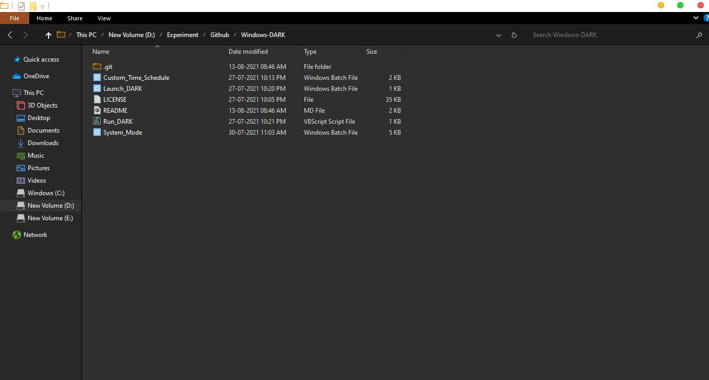
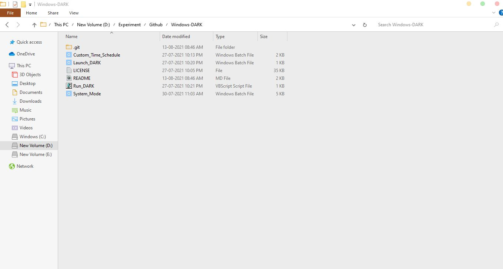
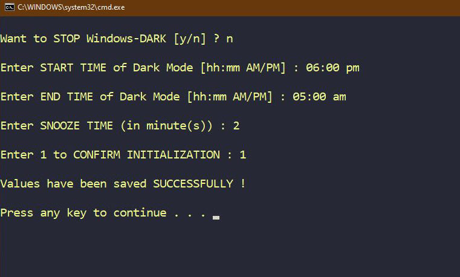

# Windows-DARK

  
  
  

  
  

A Windows based program that turns on/off DARK MODE based on custom time schedule

<h3 align=center>Dark Mode</h3>

<h3 align=center>Light Mode</h3>

## Install

- [Download](https://github.com/JustABeginning/Windows-DARK/releases) the zip file and extract/save it in a folder (Give it any name) [All the extracted components must be in the same folder].

### Auto

1. Go to the extracted folder.
1. Click on `Install.bat` file.

### Manual

1. Go to the extracted folder.
1. Create a _shortcut_ of `Launch_DARK.bat` file.
1. Press `Win+R` from keyboard or, open windows run menu, then type `shell:startup` and press enter.
1. Save the shortcut created in **step-2** in the location which opens in **step-3**.
1. Return back to the folder of **step-1** and click on `Launch_DARK.bat` file.

## Note

- This program requires that the system time is not set in 24 HR format, i.e., it is set in AM/PM format.

- In order to set custom values, use `Custom_Time_Schedule.bat` file.

  

- To skip the value of a parameter, press enter. This will accept the default/recently saved (if any) value for that parameter.
- The DEFAULT VALUES are:
  - Start HR - 05
  - Start MIN - 00
  - Start MODE - PM
  - End HR - 06
  - End MIN - 00
  - End MODE - AM
  - Snooze time - 1 minute

## Uninstall

### Auto

1. Click on `Uninstall.bat` file.

### Manual

1. Delete the `Launch_DARK.bat` _shortcut_ from the location which opens in **step-3** of **_Install_**.
1. Restart the Computer.

## 🧋 Contribution

Pull requests, issue reports and suggestions are welcome 😊 !

## :clap: A Big Thanks To

### Stargazers

