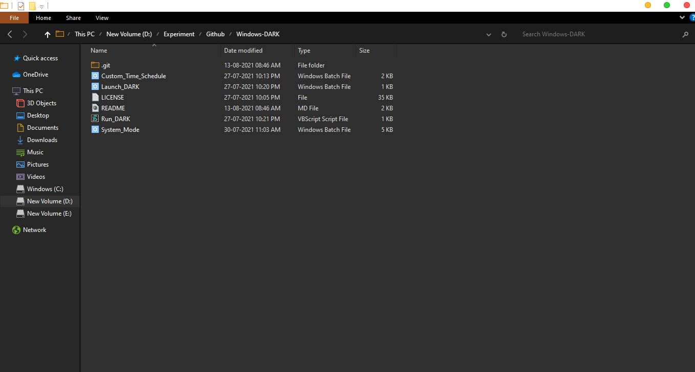
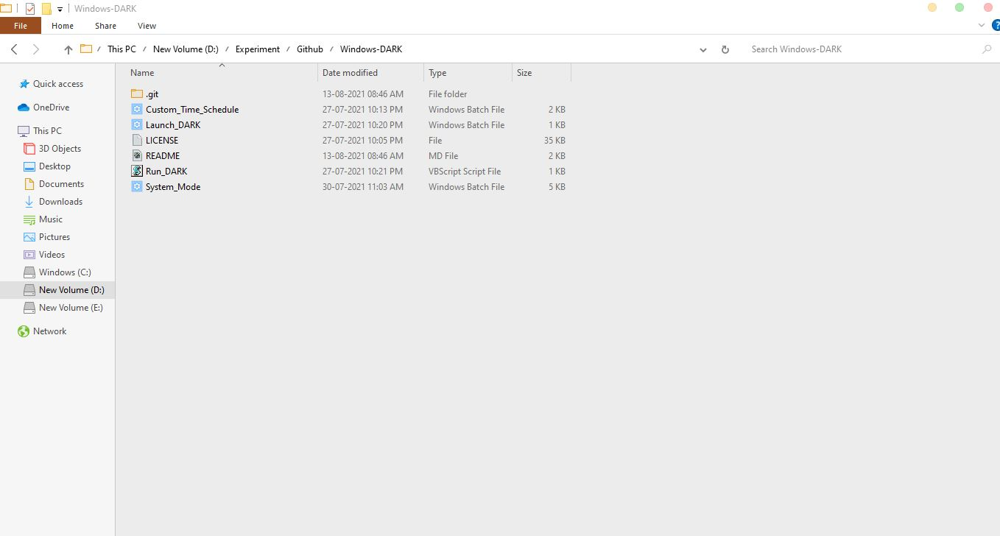
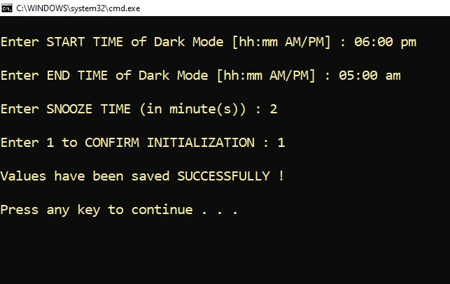

# Windows-DARK

A Windows based program that turns on/off DARK MODE based on custom time schedule

# Installation :

1. [Download](https://github.com/JustABeginning/Windows-DARK/releases) all the files and extract/save them in a folder (Give it any name) [All the files must be in the same folder].
2. Create a shortcut of `Launch_DARK.bat` file.
3. Press `Win+R` from keyboard or, open windows run menu, then type `shell:startup` and press enter.
4. Save the shortcut created in **step-2** in the location which opens in **step-3**.
5. Return back to the folder of **step-1** and click on `Launch_DARK.bat` file.

## Note :

+ This program requires that the system time is not set in 24 HR format, i.e., it is set in AM/PM format.
+ In order to set custom values, use `Custom_Time_Schedule.bat` file.

+ To skip the value of a parameter, press enter. This will accept the default/recently saved (if any) value for that parameter.
+ The DEFAULT VALUES are:
	+ Start HR - 05
	+ Start MIN - 00
	+ Start MODE - PM
	+ End HR - 06
	+ End MIN - 00
	+ End MODE - AM
	+ Snooze time - 1 minute

# Uninstallation :

1. Delete the `Launch_DARK.bat` *shortcut* from the location which opens in **step-3** of ***Installation***.
2. Restart the Computer.
